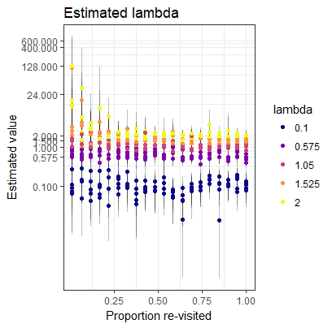
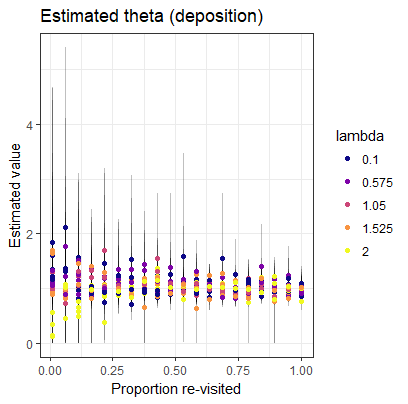
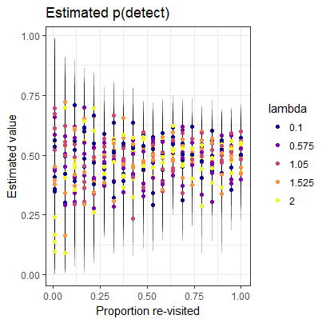

---
output:
  html_document:
    keep_md: yes
---


<style>
img.parimg {
  width: 300px;
}
div.caption { 
  padding: 25px 100px 25px 100px;
}
</style>


# Population estimation from unstructured scat surveys

Author: Alec Wong

Compiled: `r format(Sys.time(), format = '%m-%d-%Y')`


```{r setup, include=FALSE}
knitr::opts_chunk$set(echo = F, comment = NULL)

source('functions.R')

library(ggplot2)
library(dplyr)
library(foreach)
library(rgdal)

options(digits = 3)
```

## Analysis

### Statistical Model

There are three parameters to be estimated. 

<a href="https://www.codecogs.com/eqnedit.php?latex=\begin{gathered}&space;\Delta_{g,0}&space;\sim&space;\text{Poisson}(\lambda_g)\\&space;\lambda_g&space;=&space;\exp(\boldsymbol{\beta}*\textbf{X})&space;\end{gathered}" target="_blank"></a>

## Simulation

Included are files to perform simulations -- `scatCounting.R` -- testing the viability of the method described herein. The simulation uses the null model; view `model_null.txt`.

In short, the output describes an ability to identify parameters of the model, provided 25/100 grid cells were replicated once; that is, visited twice.

### Parameter estimation

<div>



</div>

<div class='caption'>
<center>
Figure 1: Parameter estimates across a gradient of lambda -- initial scat deposition -- probability of detection, and the proportion of sites that were replicated.
</center>
</div>


Note that estimation improves dramatically after approximately 25% of the sites are revisited. Following this result, we proceeded with the analysis.