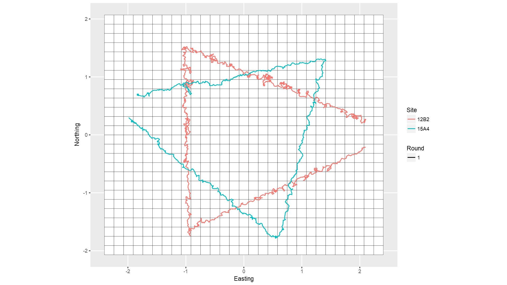
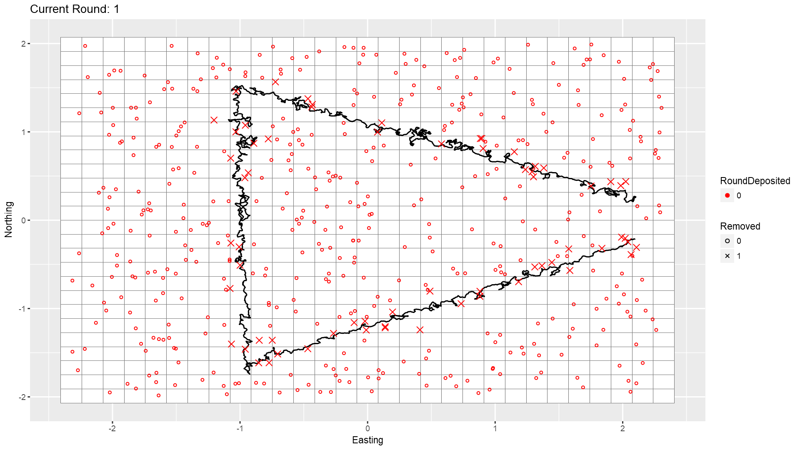
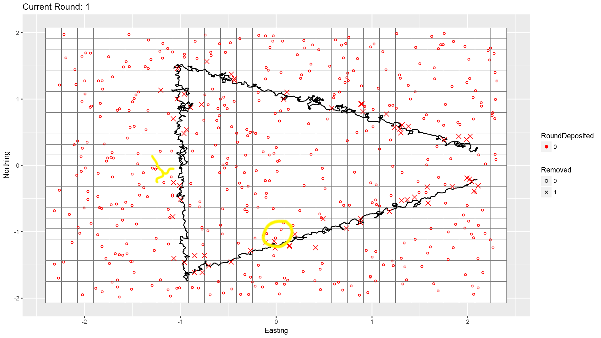
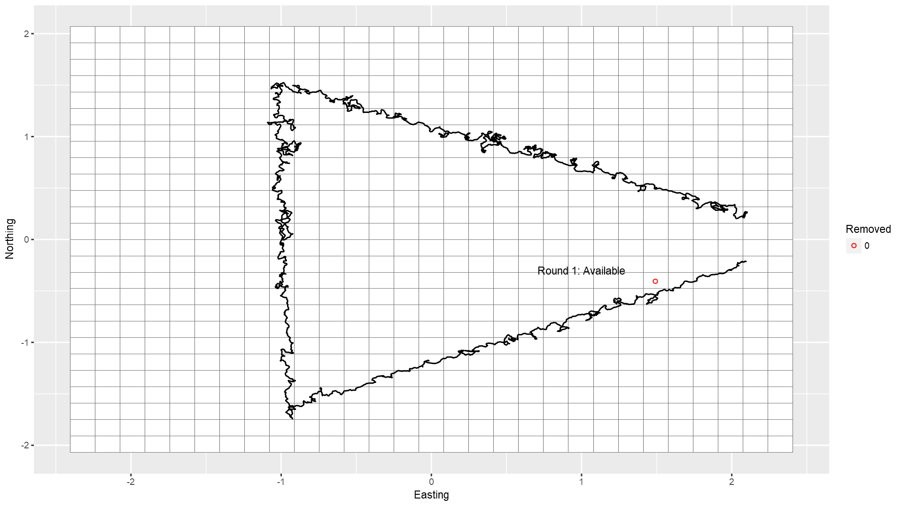
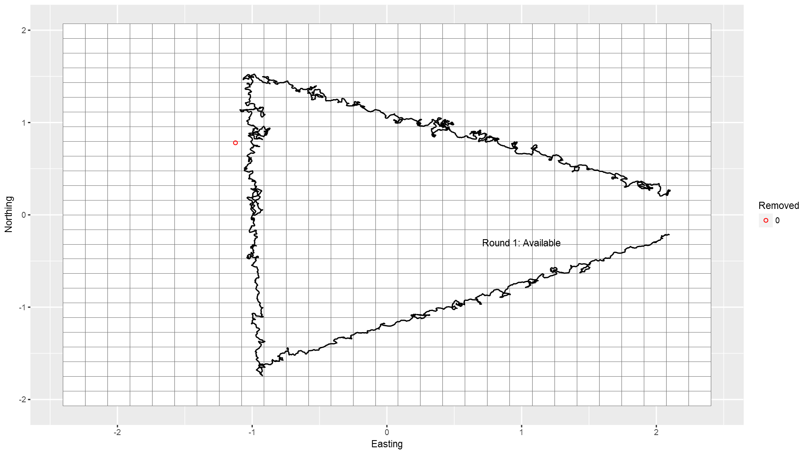

```{r setup, include=FALSE}
knitr::opts_chunk$set(echo = F)

source('functions.R')

library(ggplot2)
library(dplyr)
library(foreach)
library(broom)
library(tidyr)
library(rgdal)
```

# Overview

The major components of this simulation are as follows:

* Simulate a population of scats with a rate of deposition, to estimate the population based on simulated collections.
* Simulate collection of scats by probabilistically drawing Bernoulli samples based upon dog tracks within the grid cell coincident with the scat.
* Estimate scat deposition rate per visit using a modified spatial Jolly-Seber model that incorporates scat 'recruitment' and 'survival', where 'recruitment' is a rate of deposition, and 'survival' is fixed to 0, since all scats encountered are immediately removed.

# Simulating the data

## Dog tracks

I obtained two example dog tracks from 2017 to examine and test under this framework. The sites referenced are 12B2, and 15A4, during three consecutive visits within mid-July to August. 

The site 12B2 exhibited extremely high moose density, and thus the dog movement is no doubt affected heavily by this. In the case that this movement -- being unexplained in the model we're using -- affects model performance, the other site 15A4 was selected to be tested as well. This site exhibited no moose collections throughout the summer, and the dog movement is taken to be the most 'natural' search pattern under normal conditions. 15A4 is also relatively easy terrain, so the dogs' movement was not inhibited by thorns, slope, water, or the like.

### Examples

```{r dogExample, echo = F, message = F, warning = F, error = F, include = F}

sites = c(rep("12B2",3), rep("15A4", 3))

out = getGPX() #loads gpx files

allPoints = convertPoints() #takes gpx files and converts to a complete dataset with points, dates, sites, and 'rounds'

# Scale individual transect points. Obtain scaling parameters.

# scaled_12B2 = allPoints %>% as.data.frame() %>% filter(Site == "12B2") %>% select(Easting, Northing) %>% scale
# scaled_15A4 = allPoints %>% as.data.frame() %>% filter(Site == "15A4") %>% select(Easting, Northing) %>% scale
# 
# scaled_12B2_center = attr(x = scaled_12B2, which = 'scaled:center')
# scaled_12B2_scale = attr(x = scaled_12B2, which = 'scaled:scale')
# 
# scaled_15A4_center = attr(x = scaled_15A4, which = 'scaled:center')
# scaled_15A4_scale = attr(x = scaled_15A4, which = 'scaled:scale')
# 
# allPoints@coords[allPoints@data$Site == "12B2"] = scaled_12B2
# allPoints@coords[allPoints@data$Site == "15A4"] = scaled_15A4
# 
# meanScale = scaled_12B2_scale %>% bind_rows(scaled_15A4_scale) %>% colMeans

xlim = c(-3,3)
ylim = c(-2,2)

# Generate grid

scaledData = getScaledData(transectPoints = allPoints)

scaledGrid = scaledData$scaledGrid
scaledTracks = scaledData$scaledTracks

bbox_scaled = getBbox(scaledGrid %>% select(Easting, Northing))

for(r in 1:3){
# Cairo::Cairo(width = 1920, height = 1080, dpi = 150, file = paste0("path",r,".png"))  
#   print(
    # ggplot() +
    # geom_tile(data = scaledGrid, aes(x = Easting, y = Northing), fill = 'white', color = 'black') +
    # geom_path(data = scaledTracks %>% as.data.frame() %>% filter(Round == r), aes(x = Easting, y = Northing, color = Site, linetype = Round)) +
    # guides(color = guide_legend(order = 1), linetype = guide_legend(order = 2)) +
    # coord_cartesian(xlim = xlim, ylim = ylim) + coord_map()
#   )
# dev.off()
}

```



In the figure above, we see two triangular transects, and notice that multiple 'Rounds' or visits are made to each site, depicted in the image. They are centered such that the centroid of the transects are on 0, but independently scaled so that the transects are the same size relative to each other. The grid was first generated to be 50m x 50m, and then scaled by the same amount. To easily verify the grid size, count the squares covering the vertical portion of 12B2; they number 20, indicating that the length of the side is approximately 1km, which is true.

I scaled and centered the dog tracks so that they may sample the same population of scats, to observe any differences in estimates. Notice that 12B2 is more 'wiggly', owing to the frequency of moose scat encounters.

# Simulation of scat deposition and encounters

The deposition of scats is to be done in a Poisson random fashion, with additional 'recruitment' being added with some rate $\theta$. 

Validation requires knowledge of where the scats were generated, where dog tracks intersect the scats' grid cells, and whether they are being removed properly. 

## Scat simulation

This part is easy enough. I test using an initial deposition of 500 uniformly distributed scat piles. 

```{r scatPlot}


set.seed(1)

scats_init = 500

maxR = 3

scatXY = cbind.data.frame(ID = 1:scats_init,
                          x = runif(n = scats_init, min = bbox_scaled[1,1], max = bbox_scaled[1,2]),
                          y = runif(n = scats_init, min = bbox_scaled[2,1], max = bbox_scaled[2,2]),
                          RoundDeposited = factor(x = 0, levels = c(0:maxR)), pEnc = 0, Removed = factor(x = 0, levels = c(0,1)))

gridX = scaledGrid %>% pull(Easting) %>% unique %>% sort
gridY = scaledGrid %>% pull(Northing) %>% unique %>% sort


scatsGridRef = refPointsToGrid(queryPoints = scatXY %>% select(x,y), gridPoints = scaledGrid %>% select(Easting, Northing))

scatXY = addGridID_to_Points(queryPoints = scatXY, refPointsToGrid_Output = scatsGridRef, gridLayer = scaledGrid)

d = countPointsInGrid(queryPoints = scatXY %>% select(x,y), gridPoints = scaledGrid %>% select(Easting, Northing))

ggplot() + 
  geom_tile(data = scaledGrid, aes(x = Easting, y = Northing), fill = 'white', color = 'black') + 
  geom_text(data = d, aes(x = gridX[x], y = gridY[y], label = Freq), size = 2) + 
  # geom_path(data = allPoints %>% as.data.frame(), aes(x = Easting, y = Northing, color = RoundBySite)) + 
  geom_point(data = scatXY, aes(x = x, y = y), shape = 3, color = 'red') + 
  coord_cartesian(xlim = c(1,1), ylim = c(1,1))
  
```

In the above plot, we have scat locations (red '+'), and grid cells with numbers marking how many scat piles exist within the grid. The function written to count any given point layer within grid cells is working properly - it is zoomed in to demonstrate this, but is correct for the wider grid on the whole. 

## Dog track points within grid

I also need to verify that I'm detecting any dog track within the grids. Below, I test a function generating a probability of detection based on track length within a grid, or based on some baseline probability of detection, but for validation I am using detection == 1.

```{r scatDeposPlot, out.height=1080, out.width=1920, dpi = 150}

set.seed(1)

scats_init = 500

maxR = 3

scatXY = cbind.data.frame(ID = 1:scats_init,
                          x = runif(n = scats_init, min = bbox_scaled[1,1], max = bbox_scaled[1,2]),
                          y = runif(n = scats_init, min = bbox_scaled[2,1], max = bbox_scaled[2,2]),
                          RoundDeposited = factor(x = 0, levels = c(0:maxR)), pEnc = 0, Removed = factor(x = 0, levels = c(0,1)),
                          RoundRemoved = factor(x = NA, levels = c(1:maxR)))

gridX = scaledGrid %>% pull(Easting) %>% unique %>% sort
gridY = scaledGrid %>% pull(Northing) %>% unique %>% sort


scatsGridRef = refPointsToGrid(queryPoints = scatXY %>% select(x,y), gridPoints = scaledGrid %>% select(Easting, Northing))

scatXY = addGridID_to_Points(queryPoints = scatXY, refPointsToGrid_Output = scatsGridRef, gridLayer = scaledGrid)

recruit_rate = 200

siteToTest = "12B2"

gridLayer = scaledGrid

scatXY.rec = list(scatXY)

for(r in 1:maxR){
    
    siteTrackPoints = scaledTracks %>% as.data.frame %>% filter(Site == siteToTest, Round == r)
    
    gridsVisited = countPointsInGrid(queryPoints = siteTrackPoints, gridPoints = gridLayer %>% select(Easting, Northing)) %>% filter(Freq > 0)
    
    gridsVisitedID = cbind(x = gridX[gridsVisited$x], y = gridY[gridsVisited$y]) %>% as.data.frame %>% left_join(y = gridLayer, by = c("x" = "Easting", "y" = "Northing"))
    
    scatsAvail = scatXY %>% filter(Removed == 0, gridID %in% gridsVisitedID$ID)
    
    # To add later: a metric for encounter probability that models time and distance searched. For now, set as 1.
    scatsAvail$pEnc = 1 #later, some probability model ~ time, distance
    
    scatXY[scatXY$ID %in% scatsAvail$ID,"pEnc"] = 1
    
    # Simulate encounters. All scats encountered will be removed.
    scatXY[scatXY$ID %in% scatsAvail$ID,"Removed"] = rbinom(n = 1, size = 1, prob = scatsAvail$pEnc)
    scatXY = scatXY %>% mutate(RoundRemoved = ifelse(test = {ID %in% scatsAvail$ID & Removed == 1}, yes = r, no = RoundRemoved))
    
    # Cairo::Cairo(width = 1920, height = 1080, file = paste0('removPlot',r,'.png'), dpi = 150)
    #   print(
    #     ggplot() +
    #     geom_tile(data = gridLayer, aes(x = Easting, y = Northing), fill = 'white', color = 'black') +
    #     # geom_text(data = gridLayer, aes(x = Easting, y = Northing, label = ID)) +
    #     geom_path(data = siteTrackPoints, aes(x = Easting, y = Northing)) +
    #     geom_point(data = scatXY, aes(x = x, y = y, shape = Removed, color = RoundDeposited, size = Removed)) + 
    #     guides(color = guide_legend(order = 1), shape = guide_legend(order = 2)) + 
    #     scale_color_manual(values = c('red', 'forestgreen', 'blue')) + 
    #     scale_shape_manual(values = c(1,4)) + 
    #     scale_size_manual(values = c(1,3), guide = F) + 
    #     ggtitle(paste("Current Round:", r))
    #   )
    # dev.off()
    
    # Simulate new scat deposition; no need on last round. 
    
    if(r < maxR){ 
      
      newScatN = rpois(n = 1, lambda = recruit_rate)
      
      if(r == 1) {
        depositionLog = vector(mode = 'integer', length = maxR+1)
        depositionLog[1] = scats_init
        depositionLog[2] = newScatN
      }
      
      depositionLog[r+1] = newScatN
      
      lastID = scatXY$ID[nrow(scatXY)]
      
      scatXY = scatXY %>% bind_rows(data.frame(ID = (lastID+1):(lastID+newScatN), 
                                               x = runif(n = newScatN, min = bbox_scaled[1,1], max = bbox_scaled[1,2]),
                                               y = runif(n = newScatN, min = bbox_scaled[2,1], max = bbox_scaled[2,2]),
                                               RoundDeposited = factor(r, levels = c(0:maxR)), pEnc = 0, Removed = factor(0, levels = c(0,1))))
      
      scatsGridRef = refPointsToGrid(queryPoints = scatXY %>% select(x,y), gridPoints = gridLayer %>% select(Easting, Northing))
      
      scatXY = addGridID_to_Points(queryPoints = scatXY, refPointsToGrid_Output = scatsGridRef, gridLayer = gridLayer)
      
    }
    
    
    
    # Validate grid id's
    
    # Cairo::Cairo(width = 1920, height = 1080, file = paste0('gridIDplot',r,'.png'), dpi = 150)
    # print(
    #   ggplot() +
    #     geom_tile(data = gridLayer, aes(x = Easting, y = Northing), fill = 'white', color = 'black') +
    #     geom_text(data = gridLayer, aes(x = Easting, y = Northing, label = ID)) +
    #     geom_path(data = siteTrackPoints, aes(x = Easting, y = Northing)) +
    #     geom_point(data = scatXY, aes(x = x, y = y, shape = Removed, color = RoundDeposited), size = 5) + 
    #     scale_shape_manual(values = c(1,4))
    # )
    # dev.off()
    
    
    
    # Need a record of WHEN scats encountered. These are snapshots of the scat data from round to round.
    
    scatXY.rec[[r+1]] = scatXY
    
  }
  
  names(scatXY.rec) = paste("Round", 0:maxR)
  
  toReturn = list("ScatRecords" = scatXY.rec, "DepositionRecords" = depositionLog)
  

    
```



In the plot above, we see 500 initial scats deposited, followed by a random number of scats deposited afterward modeled as Poisson with mean = `r recruit_rate`. Since they are not reproducing in the normal sense, the recruitment rate is independent of the scat population size[^1]. 

[^1]: However, the recruitment rate might be related to the initial size deposited, since they both indicate more moose on the transect.

We observe a series of `r paste0(depositionLog[1:3])` scats deposited in the initial sample, after the first sample, and after the second sample, respectively. Of course, there is no sampling after the third sample, so that recruitment is not simulated.

In the following plot, pay particular attention to the highlighted areas:



Those scats are changing their status from 'not removed', to 'removed', demonstrating the function's proper operation. They are deposited amongst the initial sample, and on the first visit the dog track does not intersect their grid cell, and so they are not removed in the first round. In the second round, notice that the dog track intersects their grid cell, and so they are removed[^2].

[^2]: The simulation has p(detect) = 1 if there is any track within the grid whatsoever. Later, we can adjust to make it a function of distance traveled, area covered, time, or a combination of these.

## Dataset obtained

The simulated dataset is obtained by filtering out only those scats that were removed (since we would not have information about those not removed), as below:

```{r, eval = F}

knitr::kable(x = scatXY.rec[[3]] %>% filter(Removed == 1)%>% slice(1:10), format = 'html', align = 'cccccccc', digits = 2) 

```

<table>
 <thead>
  <tr>
   <th style="text-align:center;"> ID </th>
   <th style="text-align:center;"> x </th>
   <th style="text-align:center;"> y </th>
   <th style="text-align:center;"> RoundDeposited </th>
   <th style="text-align:center;"> pEnc </th>
   <th style="text-align:center;"> Removed </th>
   <th style="text-align:center;"> RoundRemoved </th>
   <th style="text-align:center;"> gridID </th>
  </tr>
 </thead>
<tbody>
  <tr>
   <td style="text-align:center;"> 7 </td>
   <td style="text-align:center;"> 2.07 </td>
   <td style="text-align:center;"> -0.39 </td>
   <td style="text-align:center;"> 0 </td>
   <td style="text-align:center;"> 1 </td>
   <td style="text-align:center;"> 1 </td>
   <td style="text-align:center;"> 1 </td>
   <td style="text-align:center;"> 317 </td>
  </tr>
  <tr>
   <td style="text-align:center;"> 16 </td>
   <td style="text-align:center;"> -0.01 </td>
   <td style="text-align:center;"> -1.24 </td>
   <td style="text-align:center;"> 0 </td>
   <td style="text-align:center;"> 1 </td>
   <td style="text-align:center;"> 1 </td>
   <td style="text-align:center;"> 1 </td>
   <td style="text-align:center;"> 160 </td>
  </tr>
  <tr>
   <td style="text-align:center;"> 20 </td>
   <td style="text-align:center;"> 1.29 </td>
   <td style="text-align:center;"> 0.55 </td>
   <td style="text-align:center;"> 0 </td>
   <td style="text-align:center;"> 1 </td>
   <td style="text-align:center;"> 1 </td>
   <td style="text-align:center;"> 1 </td>
   <td style="text-align:center;"> 487 </td>
  </tr>
  <tr>
   <td style="text-align:center;"> 37 </td>
   <td style="text-align:center;"> 1.37 </td>
   <td style="text-align:center;"> -0.52 </td>
   <td style="text-align:center;"> 0 </td>
   <td style="text-align:center;"> 1 </td>
   <td style="text-align:center;"> 1 </td>
   <td style="text-align:center;"> 1 </td>
   <td style="text-align:center;"> 284 </td>
  </tr>
  <tr>
   <td style="text-align:center;"> 41 </td>
   <td style="text-align:center;"> 1.49 </td>
   <td style="text-align:center;"> -0.41 </td>
   <td style="text-align:center;"> 0 </td>
   <td style="text-align:center;"> 1 </td>
   <td style="text-align:center;"> 1 </td>
   <td style="text-align:center;"> 2 </td>
   <td style="text-align:center;"> 314 </td>
  </tr>
  <tr>
   <td style="text-align:center;"> 43 </td>
   <td style="text-align:center;"> 1.31 </td>
   <td style="text-align:center;"> 0.61 </td>
   <td style="text-align:center;"> 0 </td>
   <td style="text-align:center;"> 1 </td>
   <td style="text-align:center;"> 1 </td>
   <td style="text-align:center;"> 1 </td>
   <td style="text-align:center;"> 487 </td>
  </tr>
  <tr>
   <td style="text-align:center;"> 45 </td>
   <td style="text-align:center;"> 0.14 </td>
   <td style="text-align:center;"> -1.20 </td>
   <td style="text-align:center;"> 0 </td>
   <td style="text-align:center;"> 1 </td>
   <td style="text-align:center;"> 1 </td>
   <td style="text-align:center;"> 1 </td>
   <td style="text-align:center;"> 161 </td>
  </tr>
  <tr>
   <td style="text-align:center;"> 50 </td>
   <td style="text-align:center;"> 0.90 </td>
   <td style="text-align:center;"> 0.93 </td>
   <td style="text-align:center;"> 0 </td>
   <td style="text-align:center;"> 1 </td>
   <td style="text-align:center;"> 1 </td>
   <td style="text-align:center;"> 1 </td>
   <td style="text-align:center;"> 542 </td>
  </tr>
  <tr>
   <td style="text-align:center;"> 57 </td>
   <td style="text-align:center;"> -0.85 </td>
   <td style="text-align:center;"> -1.61 </td>
   <td style="text-align:center;"> 0 </td>
   <td style="text-align:center;"> 1 </td>
   <td style="text-align:center;"> 1 </td>
   <td style="text-align:center;"> 1 </td>
   <td style="text-align:center;"> 68 </td>
  </tr>
  <tr>
   <td style="text-align:center;"> 60 </td>
   <td style="text-align:center;"> -0.43 </td>
   <td style="text-align:center;"> 1.31 </td>
   <td style="text-align:center;"> 0 </td>
   <td style="text-align:center;"> 1 </td>
   <td style="text-align:center;"> 1 </td>
   <td style="text-align:center;"> 1 </td>
   <td style="text-align:center;"> 621 </td>
  </tr>
</tbody>
</table>

<br />


Let's look at individual 41. The scat was deposited in round 0, but wasn't removed until round 2 - we shall see if this is correct.

```{r, eval = F}

for(r in 1:3){
  siteTrackPoints = scaledTracks %>% as.data.frame %>% filter(Site == siteToTest, Round == r)
  scatDat = scatXY.rec[[r+1]] %>% filter(ID == 41)
  shapes = c(1,4,4)
  
  labels = c("Available", "Removed", "Removed")

# Cairo::Cairo(width = 1920, height = 1080, file = paste0('indScatPlot',r,'.png'), dpi = 150)
# print(
  ggplot() +
  geom_tile(data = gridLayer, aes(x = Easting, y = Northing), fill = 'white', color = 'black') +
  # geom_text(data = gridLayer, aes(x = Easting, y = Northing, label = ID)) +
  geom_path(data = siteTrackPoints, aes(x = Easting, y = Northing)) +
  geom_point(data = scatDat, aes(x = x, y = y, shape = Removed), color = 'red') +
  scale_shape_manual(values = shapes[r]) +
  geom_text(aes(x = 1, y = -0.3), label = paste0("Round ", r, ": ", labels[r]))
  
# )
# dev.off()

}

```



In the above plot, notice that this particular scat pile is not encountered in the first occasion, due to the lack of any track points in its grid cell. In the second occasion, it is encountered due to the change in the dog track pattern directing it into the grid cell of the scat.

## Incorporating detection probability

### Indicator model

Simulation of detection probability in the 'indicator' fashion proceeds as follows:

$$
p(\text{detect}) = p_0 * I(\text{track in grid})
$$

where $I$ is the indicator function evaluating to 1 if there exists any track within the grid, and 0 if there does not. 

A Bernoulli trial is applied to each scat, simulating its encounter (and removal). Since dogs appear to be extremely discerning when it comes to detecting scats, I test using a detection probability of 0.8, but any value can be simulated.

### Length model

In future revisions, a scat's detection probability will be determined by the length of track in the grid cell that the scat occupies, in this fashion:

$$
p(\text{detect}) = p_0 * \sum_{i=1}^{I-1} \text{dist}(x_{i+1},x_i)
$$

where, $\text{dist}(x_i,x_j)$ is the euclidean distance between points $x_i$ and $x_j$. If there exists no dog track points in the grid cell, the probability of detection is zero. If by chance there is a singular point represented in a grid cell, instead of assigning it an arbitrary distance I will consider it with distance 0, and as such equivalent to no track length within the grid.

## Observation of detection process

### Indicator process

I identify a series of scats that were deposited in the first round and removed in the last for observation. 

```{r ID_scats}

scatSim = simScats(transectPoints = scaledTracks, gridLayer = scaledGrid, scats_init = 500, recruit_rate = 200, maxR = 3, debug = F, seed = 1, siteToTest = "12B2", probForm = 'indicator', p0 = 0.8)

ID1 = scatSim$ScatRecords$`Round 3` %>% filter(RoundDeposited == 0, RoundRemoved == 3) %>% pull(ID) #Those scats deposited in initial deposition, and removed in final round. 

knitr::kable(scatSim$ScatRecords$`Round 3` %>% filter(RoundDeposited == 0, RoundRemoved == 3), digits = 2)
```


#### Example: Individual 66

Observe individual 66:

```{r ID66}

ID66 = bind_rows(scatSim$ScatRecords) %>% filter(ID == 66)

rownames(ID66) = paste("Round", 0:maxR, " Snapshot")

knitr::kable(ID66)

```

Evidently, the probability of encounter was 0 until the final occasion, meaning that we ought to observe no track until round 3. 

```{r plot66, eval = F} 

# observe ind 66

for(r in 1:3){
  siteTrackPoints = scaledTracks %>% as.data.frame %>% filter(Site == siteToTest, Round == r)
  scatDat = scatSim$ScatRecords[[r+1]] %>% filter(ID == 66)
  shapes = c(1,1,4)
  
  labels = c("Available", "Available", "Removed")

Cairo::Cairo(width = 1920, height = 1080, file = paste0('indScatPlot',r,'.png'), dpi = 150)
print(
  ggplot() +
  geom_tile(data = gridLayer, aes(x = Easting, y = Northing), fill = 'white', color = 'black') +
  # geom_text(data = gridLayer, aes(x = Easting, y = Northing, label = ID)) +
  geom_path(data = siteTrackPoints, aes(x = Easting, y = Northing)) +
  geom_point(data = scatDat, aes(x = x, y = y, shape = Removed), color = 'red') +
  scale_shape_manual(values = shapes[r]) +
  geom_text(aes(x = 1, y = -0.3), label = paste0("Round ", r, ": ", labels[r]))
  
)
dev.off()

}

```



In the above plot, we do indeed see no track until round 3. 

Another way to look at the data is to see whether -- in any round -- given track in grid, about 80% of those scats should be removed. Let's observe:

```{r propRemoved, echo = T}

# Of those with p(encounter) > 0, how many removed?
table1 = scatSim$ScatRecords$`Round 1` %>% filter(pEnc > 0) %>% {summary(.$Removed)} 
names(table1) = c("Not Removed", "Removed")
print(table1)
```

We see that `r table1[2]` individuals of `r sum(table1)` individuals are removed in Round 1: this is approximately 80%, or more specifically, `r table1[2]/sum(table1)` %.

# Analysis of data

The data obtained are a record of collections per grid, per visit. Below, I randomly sample a few records from each visit to show the counts.

```{r scatData}
dataObtained = scatSim$ScatRecords$`Round 3` %>% filter(Removed == 1)

dataObtained %>% mutate(gridID = factor(gridID, levels = scaledGrid$ID), RoundRemoved = factor(RoundRemoved)) %>% group_by(RoundRemoved, gridID) %>% tally %>% group_by(RoundRemoved) %>% sample_n(5) 

```

## Statistical model


# Final update notes

At this time, the simulation is complete, and the dataset is obtained. Next tasks are to incorporate detection probability into the simulation, and provide a model with which JAGS can estimate the appropriate parameters, with the ultimate goal of a population estimate of scats. 

Options for simulating detection probability:

* Total length of path in grid cell
* Total time spent in grid cell
* Total length of path in grid cell times total time spent in grid cell (my preferred option)
* Fraction of grid cell area covered, assuming a fixed detection radius around each GPS fix point.

### Footnotes