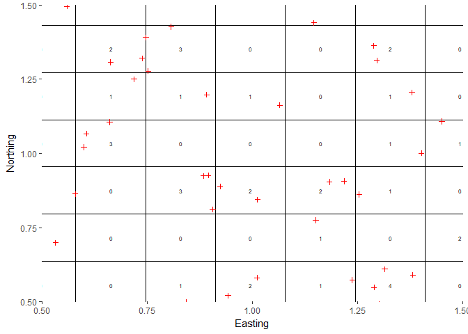

# Scat Counting Simulation
Alec Wong  
February 19, 2018  


# Overview

The major components of this simulation are as follows:

* Simulate a population of scats with a rate of deposition, to estimate the population based on simulated collections.
* Simulate collection of scats by probabilistically drawing Bernoulli samples based upon dog tracks within the grid cell coincident with the scat.
* Estimate scat deposition rate per visit using a modified N-mixture model that incorporates scat 'recruitment' and 'survival', where 'recruitment' is a rate of deposition, and 'survival' is fixed to 0, since all scats encountered are immediately removed.

# Simulating the data

## Dog tracks

I obtained two example dog tracks from 2017 to examine and test under this framework. The sites referenced are 12B2, and 15A4, during three consecutive visits within mid-July to August. 

The site 12B2 exhibited extremely high moose density, and thus the dog movement is no doubt affected heavily by this. In the case that this movement -- being unexplained in the model we're using -- affects model performance, the other site 15A4 was selected to be tested as well. This site exhibited no moose collections throughout the summer, and the dog movement is taken to be the most 'natural' search pattern under normal conditions. 15A4 is also relatively easy terrain, so the dogs' movement was not inhibited by thorns, slope, water, or the like.

### Examples


In the figure above, we see two triangular transects, and notice that multiple 'Rounds' or visits are made to each site, depicted in the image. They are centered such that the centroid of the transects are on 0, but independently scaled so that the transects are the same size relative to each other. The grid was first generated to be 50m x 50m, and then scaled by the same amount. To easily verify the grid size, count the squares covering the vertical portion of 12B2; they number 20, indicating that the length of the side is approximately 1km, which is true.

I scaled and centered the dog tracks so that they may sample the same population of scats, to observe any differences in estimates. Notice that 12B2 is more 'wiggly', owing to the frequency of moose scat encounters.

# Simulation of scat deposition and encounters

The deposition of scats is to be done in a Poisson random fashion, with additional 'recruitment' being added with some rate $\theta$. 

Validation requires knowledge of where the scats were generated, where dog tracks intersect the scats' grid cells, and whether they are being removed properly. 

## Scat simulation

This part is easy enough. I test using an initial deposition of 500 uniformly distributed scat piles. 

<!-- -->

In the above plot, we have scat locations (red '+'), and grid cells with numbers marking how many scat piles exist within the grid. The function written to count any given point layer within grid cells is working properly - it is zoomed in to demonstrate this, but is correct for the wider grid on the whole. 

## Dog track points within grid

I also need to verify that I'm detecting any dog track within the grids. Below, I test a function generating a probability of detection based on track length within a grid, or based on some baseline probability of detection, but for validation I am using detection == 1.


In the plot above, we see 500 initial scats deposited, followed by a random number of scats deposited afterward modeled as Poisson with mean = 200. Since they are not reproducing in the normal sense, the recruitment rate is independent of the scat population size[^1]. 

[^1]: However, the recruitment rate might be related to the initial size deposited, since they both indicate more moose on the transect.

We observe a series of 500, 201, 198 scats deposited in the initial sample, after the first sample, and after the second sample, respectively. Of course, there is no sampling after the third sample, so that recruitment is not simulated.

In the following plot, pay particular attention to the highlighted areas:


Those scats are changing their status from 'not removed', to 'removed', demonstrating the function's proper operation. They are deposited amongst the initial sample, and on the first visit the dog track does not intersect their grid cell, and so they are not removed in the first round. In the second round, notice that the dog track intersects their grid cell, and so they are removed[^2].

[^2]: The simulation has p(detect) = 1 if there is any track within the grid whatsoever. Later, we can adjust to make it a function of distance traveled, area covered, time, or a combination of these.

## Dataset obtained

The simulated dataset is obtained by filtering out only those scats that were removed (since we would not have information about those not removed), as below:


 ID      x        y      RoundDeposited    pEnc    Removed    RoundRemoved    gridID 
----  -------  -------  ----------------  ------  ---------  --------------  --------
 7     2.07     -0.39          0            1         1            1           317   
 16    -0.01    -1.24          0            1         1            1           160   
 20    1.29     0.55           0            1         1            1           487   
 37    1.37     -0.52          0            1         1            1           284   
 41    1.49     -0.41          0            1         1            2           314   
 43    1.31     0.61           0            1         1            1           487   
 45    0.14     -1.20          0            1         1            1           161   
 50    0.90     0.93           0            1         1            1           542   
 57    -0.85    -1.61          0            1         1            1            68   
 60    -0.43    1.31           0            1         1            1           621   

<br />


Let's look at individual 41. The scat was deposited in round 0, but wasn't removed until round 2 - we shall see if this is correct.


In the above plot, notice that this particular scat pile is not encountered in the first occasion, due to the lack of any track points in its grid cell. In the second occasion, it is encountered due to the change in the dog track pattern directing it into the grid cell of the scat.

## Incorporating detection probability

### Indicator model

Simulation of detection probability in the 'indicator' fashion proceeds as follows:

$$
p(\text{detect}) = p_0 * I(\text{track in grid})
$$

where $I$ is the indicator function evaluating to 1 if there exists any track within the grid, and 0 if there does not. 

A Bernoulli trial is applied to each scat, simulating its encounter (and removal). Since dogs appear to be extremely discerning when it comes to detecting scats, I test using a detection probability of 0.8, but any value can be simulated.

### Length model

In future revisions, a scat's detection probability will be determined by the length of track in the grid cell that the scat occupies, in this fashion:

$$
p(\text{detect}) = p_0 * \sum_{i=1}^{I-1} \text{dist}(x_{i+1},x_i)
$$

where, $\text{dist}(x_i,x_j)$ is the euclidean distance between points $x_i$ and $x_j$. If there exists no dog track points in the grid cell, the probability of detection is zero. If by chance there is a singular point represented in a grid cell, instead of assigning it an arbitrary distance I will consider it with distance 0, and as such equivalent to no track length within the grid.

## Observation of detection process

### Indicator process

I identify a series of scats that were deposited in the first round and removed in the last for observation. 


  ID       x       y  RoundDeposited    pEnc  Removed   RoundRemoved    gridID
----  ------  ------  ---------------  -----  --------  -------------  -------
  66   -1.12    0.78  0                  0.8  1         3                  501
  99    1.44   -0.48  0                  0.8  1         3                  285
 157    0.14   -1.22  0                  0.8  1         3                  161
 346   -1.07   -0.26  0                  0.8  1         3                  328
 419    0.91    0.81  0                  0.8  1         3                  542


#### Example: Individual 66

Observe individual 66:


                     ID       x      y  RoundDeposited    pEnc  Removed   RoundRemoved    gridID
------------------  ---  ------  -----  ---------------  -----  --------  -------------  -------
Round 0  Snapshot    66   -1.12   0.78  0                  0.0  0         NA                 501
Round 1  Snapshot    66   -1.12   0.78  0                  0.0  0         NA                 501
Round 2  Snapshot    66   -1.12   0.78  0                  0.0  0         NA                 501
Round 3  Snapshot    66   -1.12   0.78  0                  0.8  1         3                  501

Evidently, the probability of encounter was 0 until the final occasion, meaning that we ought to observe no track until round 3. 


In the above plot, we do indeed see no track until round 3. 

Another way to look at the data is to see whether -- in any round -- given track in grid, about 80% of those scats should be removed. Let's observe:


```r
# Of those with p(encounter) > 0, how many removed?
table1 = scatSim$ScatRecords$`Round 1` %>% filter(pEnc > 0) %>% {summary(.$Removed)} 
names(table1) = c("Not Removed", "Removed")
print(table1)
```

```
Not Removed     Removed 
         15          50 
```

We see that 50 individuals of 65 individuals are removed in Round 1: this is approximately 80%, or more specifically, 0.769 %.

# Data structure

The data obtained are a record of collections per grid, per visit. Below, I randomly sample a few records from each visit to show the counts.


```
# A tibble: 15 x 3
# Groups:   RoundRemoved [3]
   RoundRemoved gridID     n
         <fctr> <fctr> <int>
 1            1    328     1
 2            1    222     1
 3            1    621     2
 4            1    159     1
 5            1    317     1
 6            2    346     1
 7            2    487     1
 8            2    566     1
 9            2     67     1
10            2    502     1
11            3    569     2
12            3    299     2
13            3    568     1
14            3    501     2
15            3     96     1
```

Of course, we must complete the data with counts of 0 at those grids that we did visit. To do this, we pull the grid ID's from the set of all grids visited (recorded during the simulation as having track points > 0 within a grid), and then use the `complete()` function from `tidyr` to fill in the 0 counts for those grids missing from the dataset above. The data are then spread into wide format using the `spread()` function from `tidyr`.


```
   gridID  0  1  2  3
1      67 NA  0  1  0
2      68 NA  2  0  1
3      96 NA  1  0  1
4      97 NA  0  0  0
5      98 NA  1  0  0
6      99 NA  1  0  0
7     125 NA  1  0  1
8     126 NA  2  0 NA
9     128 NA  0  1  2
10    129 NA  1  0  1
11    130 NA  0  0  2
12    154 NA  0  0  0
13    159 NA  1  0  0
14    160 NA  2  0  0
15    161 NA  1  0  1
16    162 NA  0 NA NA
17    183 NA  0  0  0
18    189 NA NA  1 NA
19    190 NA  1  0  1
20    191 NA  0  0  3
```

```
[1] "..."
```
In the above dataset, I've truncated the first 20 rows for visibility. NA's exist where the site was *not* visited during each round (integer column names), and rows with all 0's exist, indicating grid cells where no counts were made, but were visited. The data are easily checked against the following plot for visual confirmation:


To prepare these data for the JAGS analysis, the NA's in the count dataset are converted to 0's, and a separate matrix is formed that is binary with 1's indicating a visited site, and 0's indicating a non-visited site, of the same dimension as the wide data. For instance, that indicator matrix appears as follows:


```
    F      
67  0 1 1 1
68  0 1 1 1
96  0 1 1 1
97  0 1 1 1
98  0 1 1 1
99  0 1 1 1
125 0 1 1 1
126 0 1 1 0
128 0 1 1 1
129 0 1 1 1
130 0 1 1 1
154 0 1 1 1
159 0 1 1 1
160 0 1 1 1
161 0 1 1 1
162 0 1 0 0
183 0 1 1 1
189 0 0 1 0
190 0 1 1 1
191 0 1 1 1
192 0 1 1 1
193 0 1 0 0
212 0 1 1 1
221 0 1 1 1
222 0 1 1 1
223 0 1 1 1
224 0 1 0 0
241 0 1 1 1
252 0 1 1 1
253 0 1 1 1
```

Again, the data are truncated for visibility. 

# Model Definition

The general idea here is that we have repeated counts of a population of individuals, which are usually modeled in the "N-mixture" fashion developed by Royle 2004, and extended for open populations by Dail and Madsen 2011. 

At any given site, the observations are modeled as binomial, with the structure

$$
y_{it} \sim \text{Bin}(N_{it},p)
$$
with $y_{it}$ being the observed counts at site $i$, on occasion $t$, $N_{it}$ being the total population available for sampling at site $i$ on occasion $t$, and $p$ the detection probability. 

Where we depart from the models of Dail and Madsen is that we model differently the population. Instead of the sum of the densities of the random variables for survival $S_{it}$ and recruitment $G_{it}$, we need not model survival if we make the assumption that the 'dying' individuals are only those we collect; analogous to perfect knowledge of 'survival'. However, we retain the basic Poisson structure for recruitment, and I relabel this $R$.

In our model here, I choose to analyze the process as follows:

|          |      Round 0    |      Round 1     |     Round 2     |     Round 3     |
| -------- | :--------------:| :-------------:  | :-------------: | :-------------: |
| N status |      $N_0$      | $N_0 + R_1 - y_1$|$N_1 + R_2 - y_2$|  $N_2+R_3-y_3$  |

In this fashion, the sums above represent the final abundance of individual scats among the observed grid cells *after* all events of collection and recruitment have occurred. The implication of this is that the counts $y_{it}$ are conditional on the sum $N_{t-1}$ as defined above. The model is as follows:

\begin{gather}
y_{it} \sim \text{Bin}(N_{i,t-1}, p_{it})\\
N_{it} = N_{i, t-1} + R_{it} - y_{it}\\
N_{i0} \sim \text{Poisson}(\lambda)\\
R_{it} \sim \text{Poisson}(\theta) ; t > 0\\
\end{gather}

The parameters to estimate are thus $\lambda$, $\theta$, and $p_{it}$. I model $p_{it}$ as homogeneous with all entries equal to $p_{00}$ which has the uninformative prior $p_{00} \sim \text{Uniform}(0,1)$. $\lambda$ is the exponent of a normal prior $\beta_0 \sim \text{Norm}(0, 0.01)$, and $\theta$ has a prior $\theta \sim \text{Uniform}(0,100)$. 


# Truth data 

I have not modeled density, so each of these are outcomes of the random variables *per grid*. There are 754 total grid cells, and we sample a total of 101 cells; that is a proportion of 0.134. The population size among the grid cells we visit in total is as follows:


```
[1] 146
```

In each round, the population size available to be sampled is:


```
Round 0 Round 1 Round 2 Round 3 
      0      65      50      48 
```
These numbers are drawn from the full simulated dataset conditional on whether the grids were visited, and the scats were not removed yet. The interpretation is, for example "In Round 1, 65 scats were left over from Round 0, and were available for encounter". Again, the population 'left over' is the sum of the population available to be sampled, plus the recruits, minus the observed individuals. Note that since Round 0 is the initial deposition period, there is no recruitment between then and the first visit, since we assume whatever happened prior to our first visit is subsumed in the model for $N_{i0}$.

We made the following observations:


```
Round 0 Round 1 Round 2 Round 3 
      0      50      35      44 
```

Per round, the proportions taken are:


```
Round 0 Round 1 Round 2 Round 3 
    NaN   0.769   0.700   0.917 
```

with mean approximately 79.53%. Note that the sum of these time-specific available population sizes is NOT the total population size, due to unobserved individuals carried between sessions. 

Our observations thus form approximately 88.356% of the scats available to be observed, which is how we simulated the process.

The recruitment rate $\theta$ was approximately 0.292.

The initial expected population size per grid $\lambda$ was approximately 0.663.

# Analysis in JAGS

The data were input into JAGS under the model defined as 'model.txt' in the parent directory of this repository. One million iterations were run with four chains, and half of these were discarded as burn-in. I selected one million iterations due to the results observed experimenting with smaller iteration sizes; often, the estimates of N were overestimated by periodic sampling of the parameters $\lambda$ and $\theta$ in extremes of the state space. When 50,000 iterations proved too small, I selected one million since the analysis time is relatively short.

To keep the dimensions of the visited sites constant, I used an indicator variable `vis[i,t]` multiplied against $p_0$ to fix the probability of encounter at unvisited sites to 0. 

The initializer function provided appears as follows:


```r
inits = function(){list(p0 = cbind(rep(NA,nSites), matrix(data = 0.8, nrow = nSites, ncol = maxR)), 
                        R = cbind(rep(NA,nSites), matrix(data = 1, nrow = nSites, ncol = maxR)),
                        N1 = rowSums(y))}
```

I initialized p0 to be the correct value, R to be relatively small, and most importantly, I initialized the first population size at all sites to be the `rowSums` of $y_{it}$. For there to be no conflicting parent values, the starting population must be *at least* as large as the observed counts, and we certainly cannot have an initial value of 0 where we have non-zero observations. 

Since we fix the first column (time 0, or initial deposition period) of $p_0$ and $R$ to be 0 within the model script, those retain NA values in the initializing function.  

## Analysis summary

A summary of the analysis follows:


```
Loading required package: lattice
```

```

Attaching package: 'jagsUI'
```

```
The following object is masked from 'package:utils':

    View
```

```
JAGS output for model 'model.txt', generated by jagsUI.
Estimates based on 4 chains of 1e+06 iterations,
burn-in = 5e+05 iterations and thin rate = 1,
yielding 2e+06 total samples from the joint posterior. 
MCMC ran in parallel for 24.4 minutes at time 2018-03-05 11:45:24.

             mean     sd   2.5%     50%   97.5% overlap0 f Rhat n.eff
N_time[1]  74.897 28.161 55.000  66.000 142.000    FALSE 1 1.08   100
N_time[2]  62.413 28.591 42.000  54.000 129.000    FALSE 1 1.08    99
N_time[3]  73.732 27.994 52.000  66.000 138.000    FALSE 1 1.08   107
N_time[4]  72.151 30.320 41.000  66.000 141.000    FALSE 1 1.06   131
p00         0.798  0.171  0.385   0.846   0.995    FALSE 1 1.05    76
theta       0.420  0.068  0.294   0.418   0.554    FALSE 1 1.00 13829
lambda      0.742  0.292  0.467   0.672   1.426    FALSE 1 1.07   109
deviance  130.744 91.029  2.363 114.169 335.528    FALSE 1 1.04    77

Successful convergence based on Rhat values (all < 1.1). 
Rhat is the potential scale reduction factor (at convergence, Rhat=1). 
For each parameter, n.eff is a crude measure of effective sample size. 

overlap0 checks if 0 falls in the parameter's 95% credible interval.
f is the proportion of the posterior with the same sign as the mean;
i.e., our confidence that the parameter is positive or negative.

DIC info: (pD = var(deviance)/2) 
pD = 3980 and DIC = 4110 
DIC is an estimate of expected predictive error (lower is better).
```

Observe that all of the estimates are within coverage except for `N_time[3]`, and `theta`. 

Also note that `N_time[1]` refers to $N_0$, and `N_time[4]` would refer to $N_3$, the population size resulting after recruitment and sampling on the third occasion. This number is of no importance to us, since we did not sample a fourth occasion. 

The model appears to be running, albeit with some biased estimates. I expect that perhaps this may be due to relatively small sample size per grid cell, or perhaps a random outcome of the simulation. More simulations should be done to validate this model.

### Footnotes
