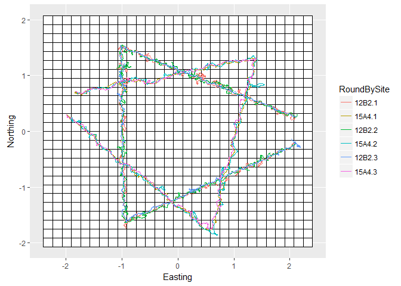

# Scat_Counting_Simulation
Alec Wong  
February 19, 2018  


# Overview

The major components of this simulation are as follows:

* Simulate a population of scats with a rate of deposition, to estimate the population based on simulated collections.
* Simulate collection of scats by probabilistically drawing Bernoulli samples based upon dog tracks within the grid cell coincident with the scat.
* Estimate scat deposition rate per visit using a modified spatial Jolly-Seber model that incorporates scat 'recruitment' and 'survival', where 'recruitment' is a rate of deposition, and 'survival' is fixed to 0, since all scats encountered are immediately removed.

# Simulating the data

## Dog tracks

We obtain two example dog tracks from 2017 to examine and test under this framework. The sites referenced are 12B2, and 15A4, during three consecutive visits within mid-July to August. 

The site 12B2 exhibited extremely high moose density, and thus the dog movement is no doubt affected heavily by this. In the case that this movement -- being unexplained in the model we're using -- affects model performance, the other site 15A4 was selected to be tested as well. This site exhibited no moose collections throughout the summer, and the dog movement is taken to be the most 'natural' search pattern under normal conditions. 15A4 is also relatively easy terrain, so the dogs' movement was not inhibited by thorns, slope, water, or the like.

### Examples


```
## OGR data source with driver: GPX 
## Source: "12B2_07.07.17_SM.gpx", layer: "track_points"
## with 6270 features
## It has 26 fields
## OGR data source with driver: GPX 
## Source: "12B2_07.30.17_SM.gpx", layer: "track_points"
## with 12661 features
## It has 26 fields
## OGR data source with driver: GPX 
## Source: "12B2_08.09.17_MP.gpx", layer: "track_points"
## with 7073 features
## It has 26 fields
## OGR data source with driver: GPX 
## Source: "15A4_07.17.17_MP.gpx", layer: "track_points"
## with 5151 features
## It has 26 fields
## OGR data source with driver: GPX 
## Source: "15A4_07.28.17_SM.gpx", layer: "track_points"
## with 5737 features
## It has 26 fields
## OGR data source with driver: GPX 
## Source: "15A4_08.07.17_JL.gpx", layer: "track_points"
## with 5927 features
## It has 26 fields
```

<!-- -->


# Simulation of scat deposition
